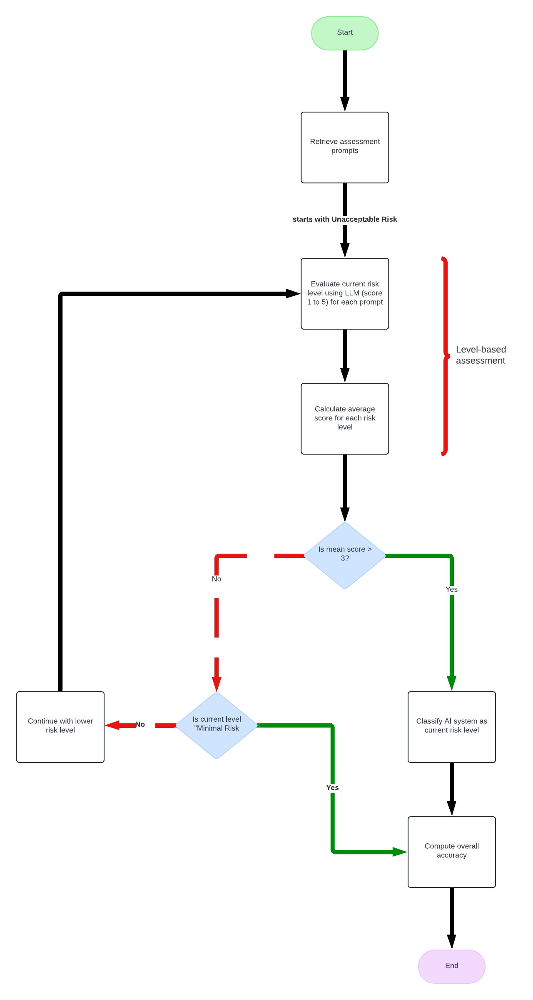

# AI EU Act Assessment

This project is designed to classify AI systems according to the **EU AI Act** using the **LLaMA 2 (7B)** model. The AI system is evaluated through several stages, including **Initial Risk Assessment**, **Level-Based Risk Assessment**, and **Risk Categorization**. The purpose is to ensure that AI systems comply with regulations and are categorized according to their risk levels.

## Table of Contents
- [Project Description](#project-description)
- [Features](#features)
- [Installation](#installation)
- [Usage](#usage)
- [AI Risk Assessment Workflow](#ai-risk-assessment-workflow)

## Project Description

This project evaluates AI systems to assess their compliance with the **EU AI Act**. The system follows a tree-based workflow, beginning with an **Initial Risk Assessment**. Based on the outcomes, it moves to **Level-Based Risk Assessment** or determines whether the AI system poses an **Unacceptable Risk**. The core components of the system include structured prompts designed for different phases of risk assessment and a fine-tuned **LLaMA 2** model to generate responses.

## Features
- **AI Risk Categorization** based on **EU AI Act** principles.
- **LLaMA 2 (7B)** model integration for automated risk assessments.
- **CSV-driven prompt system** for systematic AI evaluation.
- **Multi-step automated workflow**: Initial risk, level-based assessment, and ongoing monitoring.

## Installation

### Prerequisites

Ensure you have the following installed:
- Python 3.8+.
- Conda environment (optional but recommended).
- Hugging Face API Token (required to access the LLaMA 2 model).

### Clone the Repository
```bash
git clone https://github.com/nglinhbao/AI-EU-Act-Assessment.git
cd AI-EU-Act-Assessment
```

### Set Up Virtual Environment (Optional)
```bash
conda create --name AI-Act python=3.10
conda activate AI-Act
```

### Install Required Packages
```bash
pip install -r requirements.txt
```

### Authenticate Hugging Face
Ensure you have a Hugging Face token to access the LLaMA 2 model.

```bash
huggingface-cli login
```

Alternatively, you can export the token directly in your environment:
```bash
export HUGGINGFACEHUB_API_TOKEN="your_token_here"
```

## Usage



### Steps to Run the Assessment:

1. **Prepare the AI System Description**:
   - Create a `.txt` file containing the description of the AI system that you wish to assess.
   - Example:
     ```txt
     This AI system assists in medical diagnostics by analyzing patient health data. It processes sensitive health records and suggests possible conditions based on the data.
     ```

2. **Run the Assessment Script**:

   To start the AI system classification process, make sure you have the system description `.txt` file ready, and execute the following command:

   ```bash
   python3 main.py
   ```

3. **Prompts and AI System Evaluation**:
   - The system reads prompts from the `CSV` file (`ai_system_risk_prompts.csv`) and evaluates the AI system based on its description. 
   - If the AI system poses an **Unacceptable Risk**, the process halts and returns the result. Otherwise, it proceeds through all stages to classify the system as **High Risk**, **Limited Risk**, or **Minimal Risk**.

4. **Output**:
   - The system provides a risk categorization based on the predefined prompts in the CSV file.
   - Example outcomes include: **Unacceptable Risk**, **High Risk**, **Limited Risk**, or **Minimal Risk**.

## AI Risk Assessment Workflow

The assessment follows these key stages:

1. **Initial Risk Assessment**: 
   - The system checks for unacceptable risks, such as violations of human rights or significant societal impact.
   - If any prompt receives a "Yes" answer, the system is classified as **Unacceptable Risk** and further assessment stops.

2. **Level-Based Risk Assessment**: 
   - If no unacceptable risks are found, the system moves to a more detailed evaluation based on its impact on human health, safety, security, and privacy.

3. **Risk Categorization**: 
   - The system is classified as either **High Risk**, **Limited Risk**, or **Minimal Risk** based on the results of the previous assessments.

4. **Ongoing Monitoring**: 
   - Additional monitoring prompts ensure that the system remains compliant with ethical and performance standards over time.
